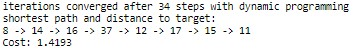

# Route-planner-algorithm
Find the shortest route using A* algorithm and graphs (Route Planner application)

This is the final project of UDACITY's [Data Structures & Algorithms Nanodegree Program](https://www.udacity.com/course/data-structures-and-algorithms-nanodegree--nd256).

The objective of the project is to use A* search to implement a "Google-maps" style route planning algorithm. The code should not contain any unnecessary performance overhauls (such as unnecessary duplication of lists or looping through a large set or dictionary when a single constant-time lookup is possible). Methods and functions should be optimal and efficient. 

# Project content

The project uses a graph with 40 location points. Existing edges (roads) between locations are provided as well as the (x,y) coordinates of all location points.
The objective is to find the shortest route from a starting location to a goal location.
The algorithm outputs the shortest travelling distance and the shortest route (ordered sequence of traversed locations).

I implement 4 different algorithms in the py file.
- Calculation of the shortest route using Dijkstra algorithm
- Calculation of the shortest route using Uniform Cost algorithm
- Calculation of the shortest route using A* optimal algorithm used for route planning
- Calculation of the shortest route using dynamic programming and Bellman equation 

While the A* algorithm outputs the shortest path, the Uniform cost algorithm returns all possible paths and select the shortest. This adds a functionality as it allows to select the second best alternative route just like in an existing route planner. This can of course also be implemented for A*.

# A* algorithm

A-Star Search algorithm is one of the best and popular technique used in path-finding and graph traversals. Many games and web-based maps use this algorithm to find the shortest path very efficiently. It is often used in video games for each enemy to find a path to the goal (ex. WarCraft).

A* always selects the location with shortest total distance from start to goal ("Best estimated total path cost first"). This is superior to Uniform Cost algorithm which always selects the location with shortest distance from the start location ("Best path cost first"), therefore leading to excessive exploration of the map. On the other hand, Uniform cost is guaranteed to return the shortest path.

A* uses a heuristic function to estimate the distance between two locations. A* is guaranteed to find the solution provided this estimating function returns a distance which is less than or equal to the true path length between the points. Since the 2D coordinates of each locations are provided, I use the euclidian distance, or straight-line distance, between a point and the target. This is guaranteed to be shorter than reality.

As a consequence, A* combines the advantages of a greedy search and the Uniform Cost search which is guaranteed and provides the best search strategy.

A* estimation function f can be broken into: `f = g + h` where `g` is the path cost from the start location up to current location and `h` is the estimated distance from the current location to the goal point.
- By minimizing `g`, the algorithm allows to keep the path as short as possible.
- By minimizing `h`, it allows to stay focused on finding the goal (and reduce unnecessary exploration).

Besides the **euclidian distance**, 2 other estimators are commonly used:
- **Manhattan distance** counting the sum of the necessary movements on x and y axis. Used when only vertical and horizontal movements are allowed.
- **Diagonal distance**. This counts the maximum of either the vertical distance on y axis or the horizontal distance on x axis. This guarantees to be optimistic about the true distance (pythagore theorem). This is used when it is allowed to move on all 8 directions of a 2D chessboard (think of the queen in Chess).
The Euclidean distance is used when all directions are allowed.

In the worst case, time complexity is O(E), where E is the number of edges in the graph (like roads), since a good heuristic allows A* to prune away many of the nodes that a less efficient (or 'uninformed') search would expand. A* is called 'informed' search because some additional information is also present, which make it easy to reach the goal (the estimation of the distance to the target).

You can read a more detailed A* review [here](https://www.geeksforgeeks.org/a-search-algorithm/).

# Dynamic programming approach

I adapted the code from this detailed [article](https://python.quantecon.org/short_path.html).
Dynamic programming breaks down the optimization problem into smaller ones and re-use previous calculation to be more efficient than a recursive solution for example. Here the algorithm aims to approximate the function j() which provides the least path cost from a node to the target. Assuming we know this function, then we can write the Bellman equation:
- `j(nodeA) = min [ C(nodeA, nodeB) + j(nodeB) ] over all nodeB which are neighbours of nodeA`
- C() is the transition cost (or step cost) to go from nodeA to nodeB (this corresponds to the distance or edge cost)
- j() is the path cost from the node to the goal

The algorithm finds the function j() by successive iterations. For our graph, the solution is found in about 30 iterations.
The algorithm outputs a distance matrix with all node to node distance as well as the output of j for all nodes (ie shortest distance from any node to the goal). These are then used to derive the shortest path sequence.

Complexity of this approach is O(n^2) where n is the number of nodes (locations).

# Results

illustrative graph with start location (black), itinary (red) and goal location (yellow).

Returned paths using Uniform Cost algorithm (start = location_8, goal = location_11):

Convergence achieved with dynamic programming (same start -> target as above):

shortest route location_8 to location_11:

# Dependencies

- the code was run using python 3.6 and older versions of networkx 1.11 and plotly 2.0.15
